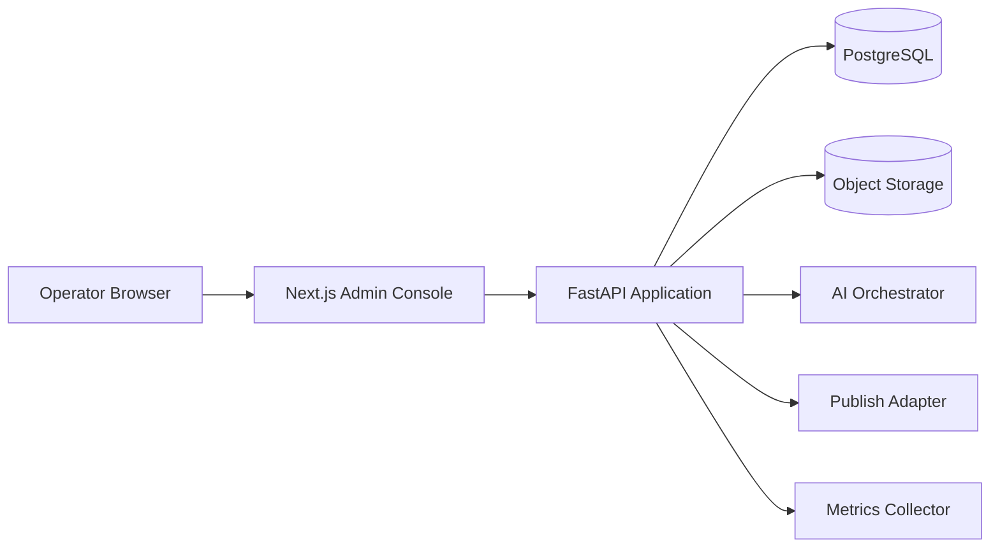

# Xiaohongshu AI Posting Platform

Feature Name: 2026-04-20-xiaohongshu-ai-posting-platform
Updated: 2026-04-20

## Description

本方案定义一个面向单账号运营的小红书 AI 发帖平台。平台提供后台管理页面，允许运营者输入主题、调用 AI 生成文案和图片、上传自有图片、对生成结果进行人工审核和修改，并在审核通过后触发发布。

## Architecture

## Components and Interfaces

- `frontend/`：后台管理端
- `backend/`：业务 API 与数据模型
- `worker/`：AI 生成任务与自动采集任务
- `shared/`：共享提示词与常量

## Data Models

- `Post`
- `Asset`
- `GenerationTask`
- `ReviewRecord`
- `PublishLog`
- `MetricsSnapshot`
