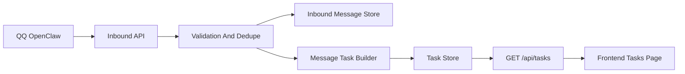

# QQ To Backend Task Ingestion

Feature Name: 2026-04-22-qq-task-ingestion
Updated: 2026-04-22

## Description

本设计定义 QQ/OpenClaw 到后端任务系统的第一阶段真实接入方案。系统先打通“消息进入系统”这一段闭环：接收入站消息、完成最小安全校验、做幂等去重、落库原始消息、创建消息任务，并将任务暴露给现有 `/api/tasks` 页面消费。

本设计明确不包含小红书真实发布、多账号自动调度、账号凭证托管和真实风控处理。

## Architecture

接入链路分为五层：
- 接入层：接收来自 QQ/OpenClaw 的 HTTP 事件。
- 校验层：校验签名、字段完整性和幂等键。
- 原始消息层：保存原始消息，方便后续追踪和重放。
- 任务生成层：把消息转成后台任务。
- 展示层：通过现有任务接口暴露给前端。

## Components and Interfaces

### 1. Inbound API

- 建议新增入口：`POST /api/integrations/qq/messages`
- 请求体最小字段：
  - `source`
  - `senderId`
  - `conversationId`
  - `content`
  - `sentAt`
  - `eventId` 或等价唯一标识
  - `signature` 或通过请求头提供签名
- 返回结果建议区分：
  - `accepted`
  - `duplicate`
  - `rejected`

### 2. Inbound Message Store

- 新增原始消息数据模型，优先持久化以下字段：
  - `id`
  - `source`
  - `senderId`
  - `conversationId`
  - `content`
  - `sentAt`
  - `receivedAt`
  - `dedupeKey`
  - `processingStatus`

### 3. Message Task Builder

- 从原始消息生成 Message Task。
- 任务最小字段：
  - `id`
  - `inboundMessageId`
  - `sourceMessage`
  - `title`
  - `topic`
  - `stage`
  - `stageLabel`
  - `nextAction`
  - `requestedAt`
  - `plannedAt`
  - `postId`
  - `accountId`
  - `requiresHumanReview`
- 第一阶段可采用保守规则：
  - `title` 由消息前若干字符生成
  - `topic` 由内容直取或简单裁剪
  - `stage` 默认使用 `pending_generation` 或 `waiting_review`

### 4. Task Query Interface

- 继续复用 `GET /api/tasks`
- 来自真实 QQ 消息的任务与当前推导任务结构保持兼容
- 若真实任务存在，优先返回真实任务

## Data Models

### InboundMessage

- `id: str`
- `source: str`
- `senderId: str`
- `conversationId: str`
- `content: str`
- `sentAt: str`
- `receivedAt: str`
- `dedupeKey: str`
- `processingStatus: str`

### MessageTask

- `id: str`
- `inboundMessageId: str`
- `sourceMessage: str`
- `title: str`
- `topic: str`
- `stage: str`
- `stageLabel: str`
- `nextAction: str`
- `requestedAt: str`
- `plannedAt: str | None`
- `postId: str | None`
- `accountId: str | None`
- `requiresHumanReview: bool`

## Correctness Properties

1. 同一条 QQ 事件不能重复创建多条原始消息记录。
2. 同一条 QQ 事件不能重复创建多条消息任务记录。
3. 任何成功接收的任务都必须能追溯到原始消息。
4. 在第一阶段中，消息接入成功不应触发小红书发布。
5. 第一阶段产生的任务必须可通过 `/api/tasks` 被前端读取。

## Error Handling

- 签名无效：返回 `rejected`，记录安全错误。
- 字段不完整：返回 `rejected`，记录字段校验错误。
- 重复消息：返回 `duplicate`，不重复建任务。
- 原始消息写入失败：返回 `rejected`，保留错误上下文。
- 任务创建失败：原始消息可保留为 `accepted_with_task_failure` 或等价状态，便于重试。

## Test Strategy

- 接口测试：覆盖合法消息、缺字段消息、签名失败消息、重复消息。
- 服务测试：覆盖去重逻辑、任务创建逻辑、默认字段填充逻辑。
- 回归测试：确保 `/api/tasks` 兼容现有前端消费结构。

## References

[^1]: `.monkeycode/team-context/backend.md`
[^2]: `.monkeycode/docs/API_CONTRACT.md`
[^3]: `backend/app/api/routes/tasks.py`
